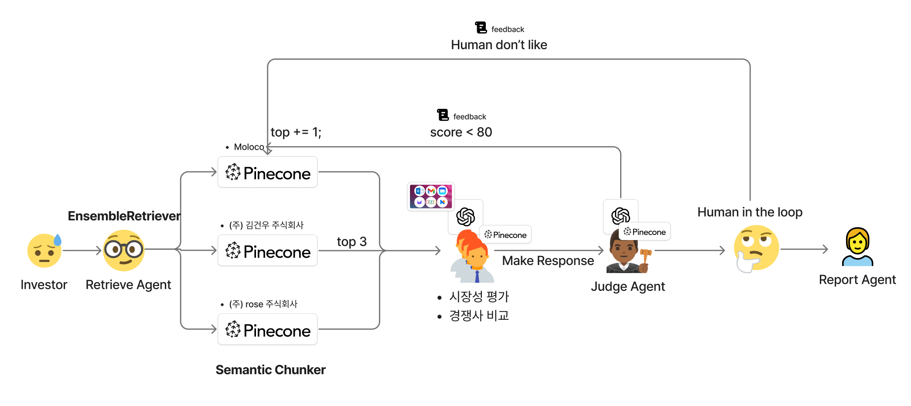
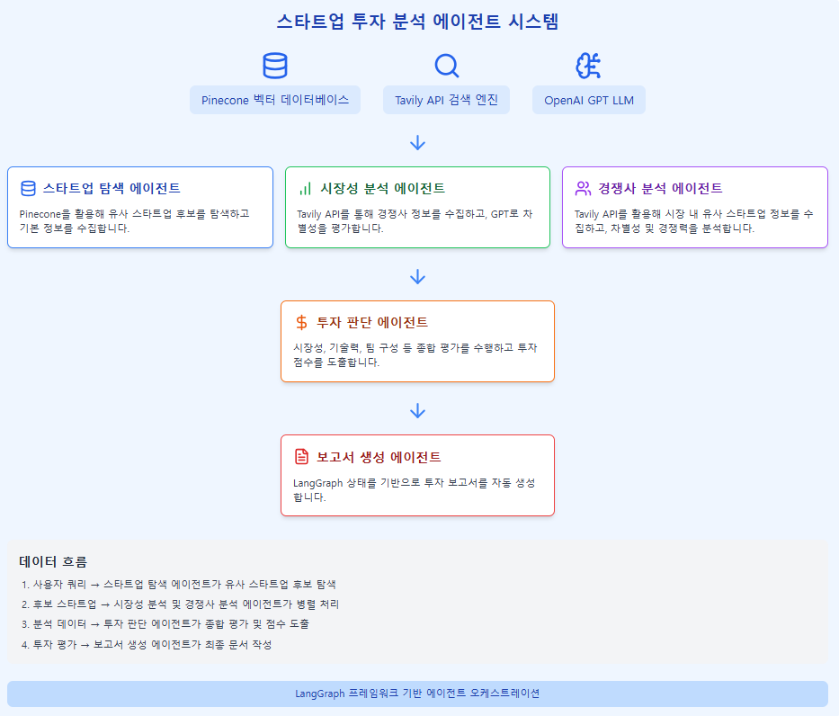

# AI Startup Investment Evaluation Agent
본 프로젝트는 인공지능 스타트업에 대한 투자 가능성을 자동으로 평가하는 에이전트를 설계하고 구현한 실습 프로젝트입니다.

## 📊 시스템 동작 플로우

## 🚀 Features

- 사용자 쿼리 기반 도메인 추출 및 스타트업 후보 자동 탐색
- Tavily API를 활용한 경쟁사 정보 수집 및 차별성 분석
- GPT-3.5-turbo를 통한 경쟁력 점수화 및 평가 근거 생성
- 투자 판단 기준(시장성, 기술력, 팀 등)에 따른 에이전트 평가 흐름
- LangGraph 상태 기반 최종 투자 보고서 자동 생성 (LLM 요약 포함)

## 🤖 Agents

- **스타트업 탐색 에이전트**: Pinecone을 활용해 유사 스타트업 후보를 탐색합니다.
- **시장성 분석 에이전트**: Tavily API를 통해 경쟁사 정보를 수집하고, GPT로 차별성을 평가합니다.
- **경쟁사 분석 에이전트**: Tavily API를 활용해 시장 내 유사 스타트업 정보를 수집하고, 차별성 및 경쟁력을 분석합니다.
- **투자 판단 에이전트**: 시장성, 기술력, 팀 구성 등 종합 평가를 수행하고 투자 점수를 도출합니다.
- **보고서 생성 에이전트**: LangGraph 상태를 기반으로 투자 보고서를 자동 생성합니다.

## 🛠️ Tech Stack

| Category   | Details                                      |
|------------|----------------------------------------------|
| Framework  | LangGraph, LangChain, Python                 |
| LLM        | GPT-3.5-turbo via OpenAI API                 |
| Retrieval  | Pinecone (벡터 DB), Hugging Face KURE-v1 임베딩 |
| Web Search | Tavily API (실시간 경쟁사 정보 수집)         |

## Contributors 
- 김건우 : 경쟁사 분석 에이전트
- 김세연 : 스타트업 탐색 에이전트
- 양석우 : 시장성 분석 에이전트
- 이재원 : 투자 판단 에이전트, 보고서 생성 에이전트

## Directory 구조
project/
├── main.py                  # LangGraph 전체 실행 로직
├── run_main.py              # .env 불러와 main 실행하는 진입점
├── .env                     # API 키 등 환경 변수 설정 파일
├── requirements.txt         # 프로젝트 의존성 목록
├── state_definitions.py     # 전체 평가 상태(GraphState) 정의=
├── agents/                  # 에이전트 모듈 모음
│   ├── __init__.py
│   ├── startup_explorer.py     # 스타트업 탐색 에이전트 (김세연)
│   ├── market_researcher.py    # 시장성 분석 에이전트 (양석우)
│   ├── competitor_analyzer.py  # 경쟁사 분석 에이전트 (김건우)
│   ├── investment_judge.py     # 투자 판단 에이전트 (이재원)
│   └── pdf_generator.py        # 보고서 생성 에이전트 (이재원)
├── investment_report.pdf    # 최종 생성되는 투자 보고서 (예시)
└── README.md                # 프로젝트 설명서
